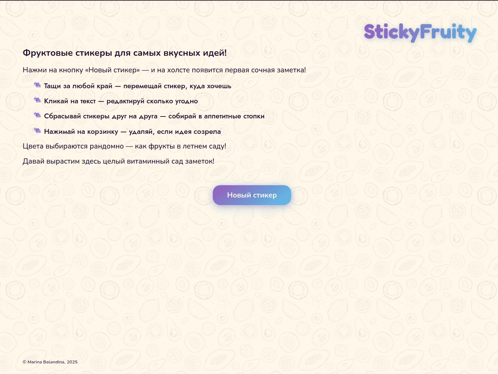
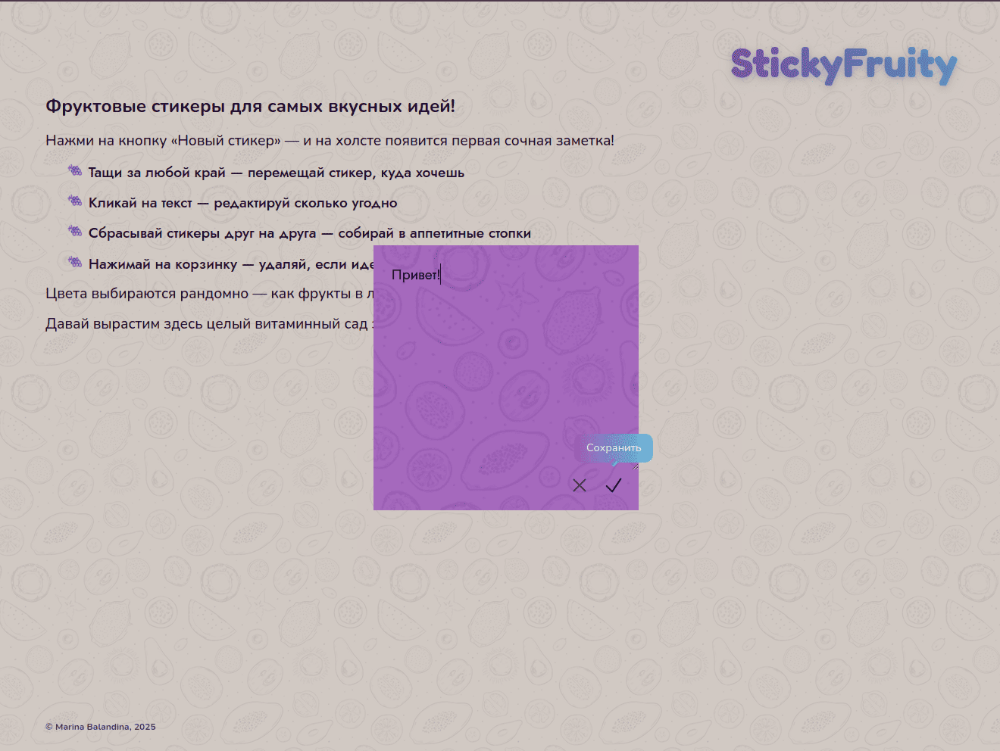
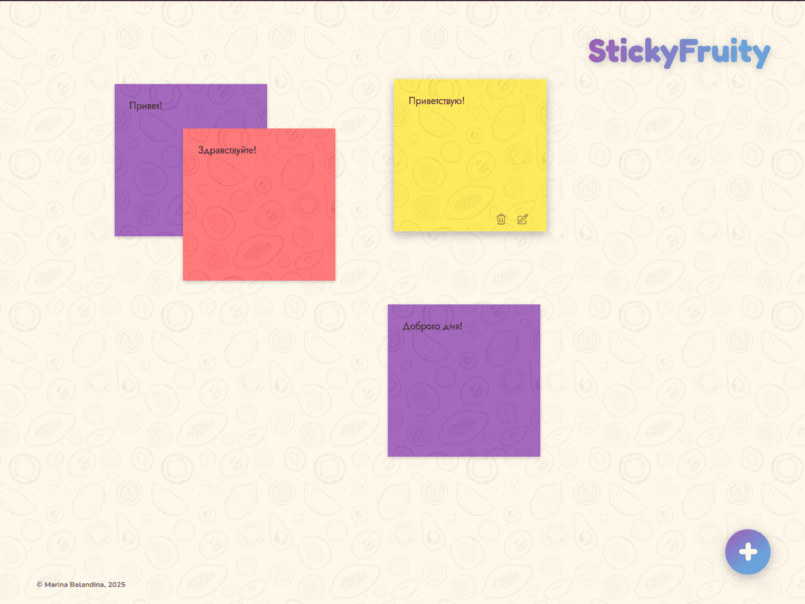
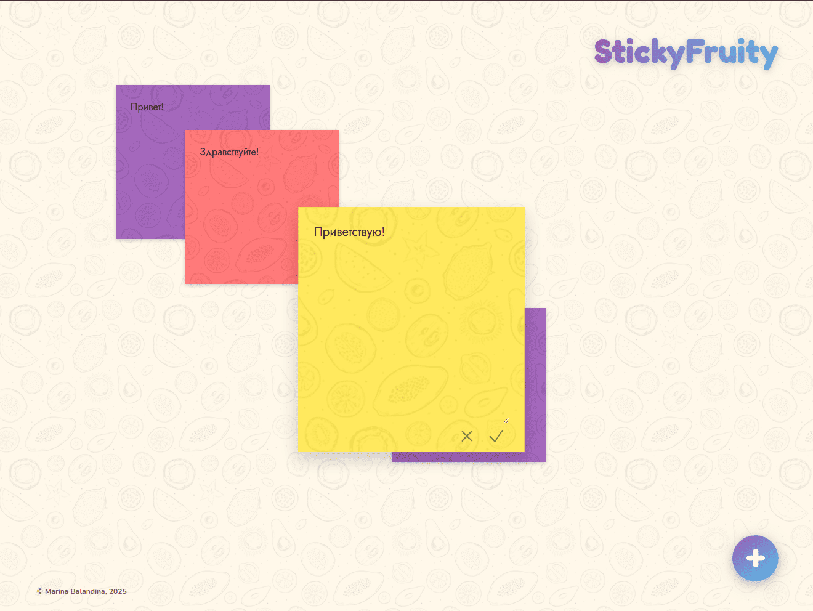

# 🟡 StickyFruity 

[](https://balandinam.github.io/StickyFruity/)
[](https://github.com/BalandinaM/StickyFruity)

Интерактивное приложение для работы со стикерами в браузере с полным сохранением состояния.

## ✨ Основные функции
- 🖱️ Drag-and-drop перемещение
- ✏️ Редактирование текста
- 🗑️ Удаление стикеров
- 📌 Запоминание позиций
- 🎨 Все изменения сохраняются в локальное хранилище

## 🛠 Технологический стек
- **React 19** + Vite
- **React DnD** для перетаскивания
- **LocalForage** для хранения
- **Nanoid** для генерации ID
- **Sass** для стилей
- **Деплой** GitHub Pages
- **ReactTooltip** для тултипов

## 🚀 Запуск
1. Установите зависимости:

```npm install```

2. Запустите dev-сервер:

```npm run dev```

### Для production-сборки:

```npm run build```


## 📸 Скриншоты

| Описание | Скриншот |
|----------|----------|
| **Начало работы** |  |
| **Создание нового стикера** |  |
| **Доска со стикерами** |  |
| **Редактирование стикера** |  |


## 📌 Планы по развитию

- Замена системных алертов на стильные всплывающие уведомления для всех ключевых действий пользователя.
- Добавить авторизацию и синхронизацию между устройствами
- Адаптация интерфейса под смартфоны и планшеты
